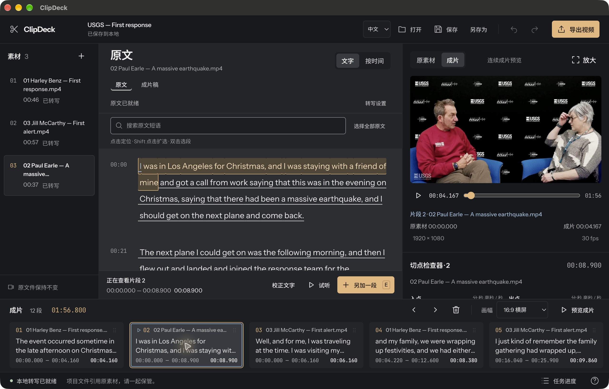

# ClipDeck

Build a rough cut by choosing the words you want to keep from your own videos.

[简体中文](README.zh-CN.md) · [Contributing](CONTRIBUTING.md) · [Local data](docs/local-data.md) · [Verification](docs/verification/benchmarks.md)

ClipDeck is a local desktop editor for interviews, lessons and spoken recordings. Import several videos, read their transcripts, select passages, arrange them into one story, check the assembled preview, and export an MP4. Files and transcription stay on your computer after explicit model setup.

**Status:** [experimental Apple Silicon Mac preview](https://github.com/lsj0914/clipdeck/releases/tag/v0.1.0-preview.2). Download the exact app, an editable real-interview project and its exported film. The [preview verification record](docs/verification/preview-2.md) describes the actual desktop checks and remaining limits. The app is not Developer ID signed or notarized.



[Watch the 50-second desktop walkthrough](https://github.com/lsj0914/clipdeck/releases/download/v0.1.0-preview.2/ClipDeck-desktop-walkthrough.mp4) · [Download the editable interview demo](https://github.com/lsj0914/clipdeck/releases/download/v0.1.0-preview.2/ClipDeck-USGS-demo-20261007.zip)

## The workflow

1. **Import your videos.** Use the native file picker. Projects keep references to the originals, so retain the source files.
2. **Create a transcript, or use a time range.** English and Chinese recognition run locally, with punctuation and sentence grouping in the saved result. Prepare the selected model explicitly; silent footage can be cut without transcription.
3. **Keep a passage.** Select its words, audition it against the original, and add it to the assembly. Repeat across sources.
4. **Shape the story.** Reorder passages, adjust in/out points, and use undo/redo. Check the continuous assembly preview before exporting. Use the preview's **Expand** control to inspect the source or assembly across the window; **Esc** returns to editing at the same playback position.
5. **Export and save.** Export a playable MP4 and save a `.clipdeck` project to continue later. Open the completed file from Processing and use **Expand preview** to check it across the window. **Esc** first reduces the player, then returns to editing. Moving originals requires relinking; changed source bytes invalidate old anchors.

The core is multi-source speech editing rather than a traditional effects timeline. Source playback and assembled playback are separate. The assembly preview and final export use the same frame/sample edit plan, including clips with different sizes and frame rates.

Choose **Source** or **Assembly** above the player to control navigation. Clicking a bottom cut jumps to that cut's start in the chosen video; clicking transcript words locates their corresponding position. Ordinary jumps keep playback running or paused. In Assembly, repeated passages use the selected occurrence, and text outside the current cuts is explained without switching videos. Cut and selected-text auditions, including cut loops, use the chosen preview. A new manual time range belongs to its source and is auditioned there before being added. Click the assembly script's passage to locate it, or **Edit cut** to open its boundaries.

## Scope and constraints

- Local word timestamps, cancellable jobs, manual ranges, project recovery and explicit relinking.
- Landscape 16:9, portrait 9:16 and square output. The whole source image fits inside the selected frame; padding preserves its edges. Output is H.264/AAC, 30 fps, 48 kHz stereo.
- Compatible originals can be tried immediately; media that the browser cannot decode uses a normalized preview. Export always processes the original source.
- Choose Small (486 MB) or the optional Large v3 turbo (1.62 GB) model explicitly. Vocabulary hints and anchored text corrections help check recognition while retaining source timing. Names, accents and specialist vocabulary still need review; there is no claimed word-error benchmark. See [models and correction evidence](docs/asr-models.md).
- Local transcription supports individual sources up to six hours. Jobs run one transcription at a time, decode with an explicit size ceiling, and read five-minute audio windows. Overlap timing remains marked for review; split longer sources before requesting transcription.
- Full-source preview and the assembled output are limited to six hours. Longer sources can still be imported and edited, with shorter selections exported; split the source if you need full-source playback. Preview cache: eight owned artifacts and 4 GiB; assembly staging: 16 GiB. Text editing remains available when preview is unavailable.
- No cloud account, automatic highlight scoring, subtitles, effects, collaboration or professional project-format export in this first release.

The intended binary floor is macOS 14 on ARM64. Native tests and sandboxed startup have run on macOS 15.7.9 in GitHub Actions and macOS 27.0.1 locally; macOS 14 execution and Intel/Windows/Linux are unverified. These checks do not establish the complete packaged desktop workflow. Preview packaging is ad-hoc signed, without Developer ID signing or notarization. See [packaging and distribution status](docs/packaging.md).

## Develop and verify

Use Node 24 and the locked dependencies. The Python/media resources are exact pinned archives, not replacements from the developer's PATH.

```sh
npm ci
npm run prepare:electron
python3 scripts/packaging/prepare_resources.py --assets-dir ../clipdeck-downloads --release-base-url https://github.com/lsj0914/clipdeck/releases/download/resources-bootstrap-0.1.0 --output .runtime --layout developer
node scripts/ci/prepare-model.mjs
npm run typecheck
npm test -- --maxWorkers=2
npm run build
npm start
```

The five exact runtime, punctuation and source archives are available in the [resources-only prerelease](https://github.com/lsj0914/clipdeck/releases/tag/resources-bootstrap-0.1.0). Preparation downloads anonymously and verifies every pinned size and hash; this resource release is separate from the experimental application preview. [Packaging guide](docs/packaging.md) documents the complete route. The CI model helper explicitly downloads the pinned Small model to its canonical test cache; it verifies cache hits and rejects corrupt existing content.

The repository also separates resource-free unit checks from native checks. [Contributing](CONTRIBUTING.md) has the exact commands. A successful bundle build or desktop smoke is not evidence of the complete import-to-export workflow. Fixture-gated ASR checks are explicitly skipped when their recordings are absent. [Benchmark notes](docs/verification/benchmarks.md) distinguish generated fixtures, recorded speech, fresh processes, filesystem-warm runs and measured limits.

## Related projects

Text-based editing has an existing ecosystem. [OpenScript](https://github.com/preston176/openscript) and [Toaster](https://github.com/alexmpowers/toaster) are related projects; [LosslessCut](https://github.com/mifi/lossless-cut) and [Auto-Editor](https://auto-editor.com/) solve useful adjacent editing tasks. ClipDeck's implementation focuses on a recoverable local multi-source workflow and matching preview/export with explicit correctness evidence.

## License

[GPL-3.0-or-later](LICENSE). Bundled runtimes, fonts, models and media libraries have their own licenses. [Third-party notices](THIRD_PARTY_NOTICES.md) and the packaging source archives retain them. User recordings are never part of the repository or public demo.
